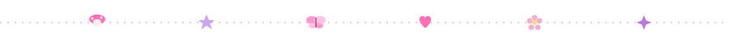
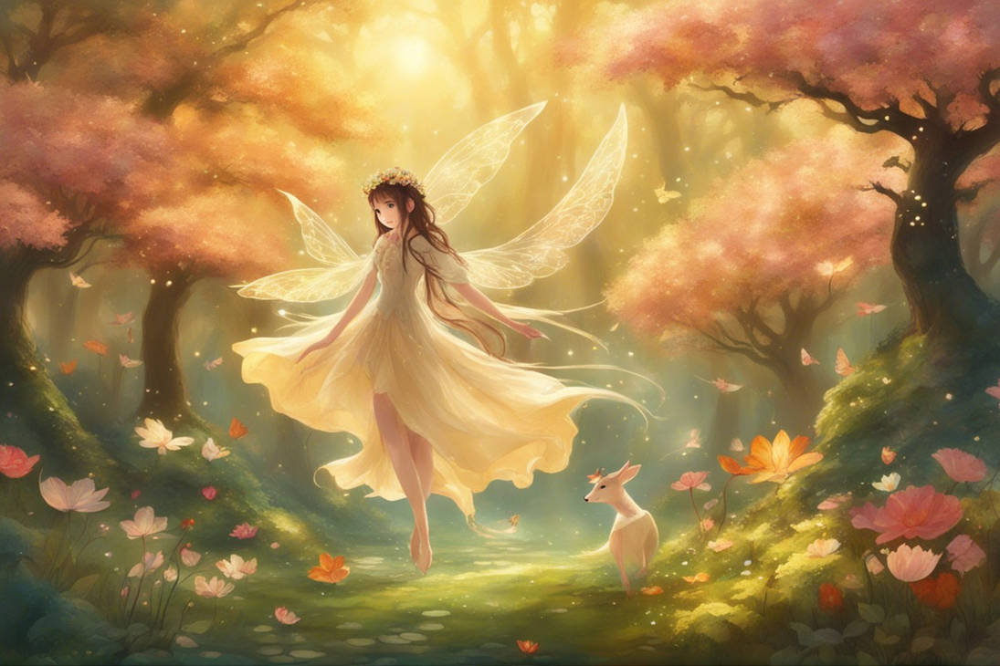
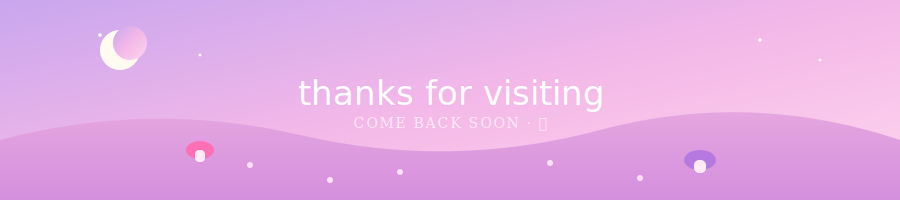

## 🌸 about me

<table>
<tr>
<td width="60%" valign="top">

Hii, I'm **Aarna** — a full-stack developer from India 🇮🇳 who believes code should feel as pretty as it functions. Somewhere between debugging and daydreaming, I'm usually designing something soft, pastel, and a little magical. 🦋

- 🎨 **design philosophy** — beauty + function, always together
- 💻 **coding style** — clean, elegant, cottagecore-coded
- 🍬 **fuel** — kaju katli and good vibes
- 🗼 **dream** — coding from a café in Paris
- 🧪 **secret love** — chemistry, the *real* kind of reactions

</td>
<td width="40%" valign="top" align="center">

🌷🦋🌷  
**currently...**  
building beautiful  
web experiences  
one pastel commit  
at a time ✨

</td>
</tr>
</table>

## 🎀 my sparkly toolkit

## 💗 github garden

## 🏆 little milestones

| 🌷 skill | progress |
|:---|:---|
| **code quality** | 🌸🌸🌸🌸🌸🌸🌸🌸🌸🤍 95% |
| **design eye** | 🌸🌸🌸🌸🌸🌸🌸🌸🤍🤍 88% |
| **problem solving** | 🌸🌸🌸🌸🌸🌸🌸🌸🌸🤍 92% |
| **team spirit** | 🌸🌸🌸🌸🌸🌸🌸🌸🌸🌸 98% |

## 🌟 projects i love

<table>
<tr>
<td align="center" width="50%">

<table>
<tr>

<!-- 🍄 Portfolio -->
<td align="center" width="50%">

🍄 portfolio website  

  

</td>

<!-- 🦋 Repos -->
<td align="center" width="50%">

🦋 all my repos  

  

</td>

</tr>
</table>

 

## 🍭 beyond the code

<table>
<tr>
<td align="center" width="33%">

**🗼 dream destination**  
Paris, France  
*café + croissant + coffee* ☕

</td>
<td align="center" width="33%">

**🍽️ favorite treats**  
🍗 chicken · 🍰 strawberry chessecake · 🥭 lychee

</td>
<td align="center" width="33%">

**⚗️ secret passion**  
chemistry — real reactions,  
not just code ones 🧪

</td>
</tr>
</table>

🎀 <b>click for more sparkly facts</b>

 

> "code with heart, design with soul, sprinkle a little sparkle everywhere ✨" — aarna

**my coding rituals** ☕🌙  
morning coffee → lo-fi playlist → late night coding bursts → kaju katli breaks → celebrating every tiny bug fix 🐛💗

| 🌸 category | favorite |
|:---:|:---:|
| color palette | pinks, pastels, soft lilac |
| music | lo-fi, dreamy beats |
| learning style | hands-on projects |
| productive hours | late night 🌙 |
| dream collab | creative designers + passionate devs |

## 🌷 my little garden

🦋 grown one commit at a time

## 💌 let's be friends

